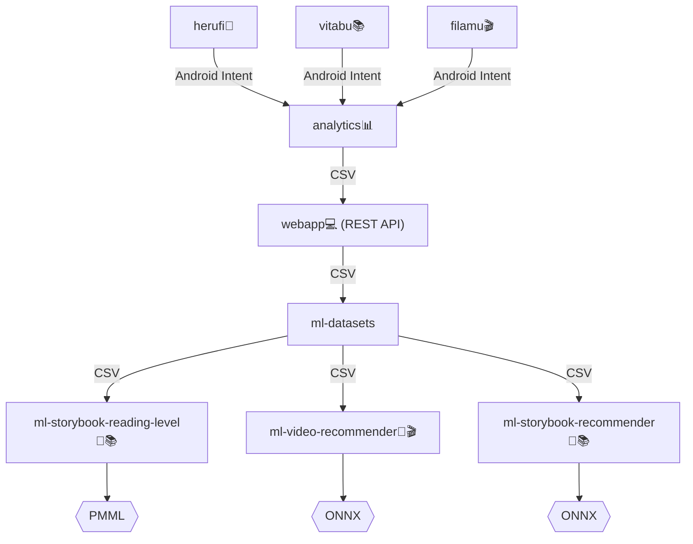

# Knowledge Base - Distribution & Data Collection 🛵💨

Knowledge base for https://github.com/orgs/elimu-ai/projects/5?pane=info

## Software Distribution 📲

### How to distribute a new Android app/game

For a new Android app to be distributed through the [elimu.ai Appstore](https://github.com/elimu-ai/appstore), you will first have to add the app for each language deployment:

1. http://eng.elimu.ai/application/list
2. http://hin.elimu.ai/application/list
3. http://tgl.elimu.ai/application/list
4. http://tha.elimu.ai/application/list
5. http://vie.elimu.ai/application/list

Press the "+" button and type the package name of your app. Then select the literacy skill or numeracy skill that the app is teaching, and press "Add."


Then upload the signed APK file of your latest release version.

> [!NOTE]
> Instead of handling releases of your app manually, we recommend you configure an automated release workflow (see [example](https://github.com/elimu-ai/vitabu/blob/main/.github/workflows/gradle-release.yml)).

## Hardware Distribution 📦

...

## Data Collection 📊

When a student interacts with one of the educational apps/games, learning events and assessment events are collected 
by the [elimu.ai Analytics](https://github.com/elimu-ai/analytics) app. From there, the data is uploaded to the 
Webapp's [REST API](https://github.com/elimu-ai/webapp?tab=readme-ov-file#rest-api).



Also note that the datasets stored in the [ml-datasets](https://github.com/elimu-ai/ml-datasets) repo are coming from multiple [data sources](https://github.com/elimu-ai/ml-datasets?tab=readme-ov-file#data-sources); Each supported language has its own server deployment and its own data collection.

### Learning Analytics

When measuring a student's learning, we use three different concepts of mastery:

1. Content mastery (see [`MasteryHelper.kt`](https://github.com/elimu-ai/analytics/blob/8d2cc10cd344029c6622d3928bc1023055009db2/utils/src/main/java/ai/elimu/analytics/utils/logic/MasteryHelper.kt))
2. Skill mastery (EGRA/EGMA)
3. Long-term memory mastery (see [`SpacedRepetitionHelper.kt`](https://github.com/elimu-ai/kukariri/blob/main/app/src/main/java/ai/elimu/kukariri/logic/SpacedRepetitionHelper.kt))

### How to make changes to the way data is stored

If you, for example, want to collect an additional piece of data, note that the backend first needs to be prepared to handle this. As an example, let's say you want to add a new column (e.g. `task_difficulty_level`) to the word assessment events CSV file generated by the elimu.ai Analytics app: [`ExportEventsToCsvWorker.kt`](https://github.com/elimu-ai/analytics/blob/main/app/src/main/java/ai/elimu/analytics/task/ExportEventsToCsvWorker.kt)

```diff
val csvFormat = CSVFormat.DEFAULT
.withHeader(
    "id",
    "time",
    "android_id",
    "package_name",
    "word_id",
    "word_text",
    "mastery_score",
+    "task_difficulty_level",
    "time_spent_ms"
)
```

> [!WARNING]
> _Before_ changing the data format, bump the minor version in the Analytics app's `versionCode` so that incompatible data doesn't get uploaded to the backend server. For example, bump the version from `3002025` to `3003000`.

Be aware that collected data gets extracted from the CSV files in the backend's [`CsvAnalyticsExtractionHelper`](https://github.com/elimu-ai/webapp/blob/main/src/main/java/ai/elimu/util/csv/CsvAnalyticsExtractionHelper.java). So for your new data column to be included, you will have to prepare that code to handle the new data format _before_ you release a new version of the Analytics app.

Example:

```java
Integer taskDifficultyLevel = Long.valueOf(csvRecord.get("task_difficulty_level"));
wordAssessmentEvent.setTaskDifficultyLevel(taskDifficultyLevel);
```

> [!CAUTION]
> Note that adding this will cause the code to crash for data collected from devices running an older version of the Analytics app. Therefore, you first need to check the version of the Analytics app:
> ```java
> if (versionCode >= 3003000) {
>     // https://github.com/elimu-ai/analytics/releases/tag/3.3.0
>     Integer taskDifficultyLevel = Long.valueOf(csvRecord.get("task_difficulty_level"));
>     wordAssessmentEvent.setTaskDifficultyLevel(taskDifficultyLevel);
> }
> ```


## Sponsors 🫶🏽

...
