# Knowledge Base - Distribution & Data Collection 🛵💨

Knowledge base for https://github.com/orgs/elimu-ai/projects/5?pane=info

## Software Distribution 📲

### How to distribute a new Android app/game

For a new Android app to be distributed through the [elimu.ai Appstore](https://github.com/elimu-ai/appstore), you will first have to add the app for each language deployment:

1. http://eng.elimu.ai/application/list
2. http://hin.elimu.ai/application/list
3. http://tgl.elimu.ai/application/list
4. http://tha.elimu.ai/application/list
5. http://vie.elimu.ai/application/list

Press the "+" button and type the package name of your app. Then select the literacy skill or numeracy skill that the app is teaching, and press "Add."

Then upload the signed APK file of your latest release version.

> [!NOTE]
> Instead of handling releases of your app manually, we recommend you configure an automated release workflow (see [example](https://github.com/elimu-ai/vitabu/blob/main/.github/workflows/gradle-release.yml)).

## Hardware Distribution 📦

...

## Data Collection 📊

When a student interacts with one of the educational apps/games, learning events and assessment events are collected 
by the [elimu.ai Analytics](https://github.com/elimu-ai/analytics) app. From there, the data is uploaded to the 
Webapp's [REST API](https://github.com/elimu-ai/webapp?tab=readme-ov-file#rest-api).

```mermaid
flowchart TD
    herufi["herufi🔡"] -->|Android Intent| analytics
    click herufi "https://github.com/elimu-ai/herufi"

    vitabu["vitabu📚"] -->|Android Intent| analytics
    click vitabu "https://github.com/elimu-ai/vitabu"

    filamu["filamu🎬"] -->|Android Intent| analytics
    click filamu "https://github.com/elimu-ai/filamu"

    analytics["analytics📊"] -->|CSV| webapp["webapp💻 (REST API)"]
    click analytics "https://github.com/elimu-ai/analytics"

    webapp -->|CSV| ml-datasets
    click webapp "https://github.com/elimu-ai/webapp"

    ml-datasets -->|CSV| ml-storybook-reading-level["ml-storybook-reading-level🤖📚"]
    click ml-datasets "https://github.com/elimu-ai/ml-datasets"

    ml-storybook-reading-level --> model-reading-level{{PMML}}
    click ml-storybook-reading-level "https://github.com/elimu-ai/ml-storybook-reading-level"

    ml-datasets -->|CSV| ml-video-recommender["ml-video-recommender🤖🎬"]
    click ml-video-recommender "https://github.com/elimu-ai/ml-video-recommender"

    ml-video-recommender --> model-videos{{ONNX}}

    ml-datasets -->|CSV| ml-storybook-recommender["ml-storybook-recommender🤖📚"]
    click ml-storybook-recommender "https://github.com/elimu-ai/ml-storybook-recommender"

    ml-storybook-recommender --> model-storybooks{{ONNX}}
```

Also note that the datasets stored in the [ml-datasets](https://github.com/elimu-ai/ml-datasets) repo are coming from multiple [data sources](https://github.com/elimu-ai/ml-datasets?tab=readme-ov-file#data-sources); Each supported language has its own server deployment and its own data collection.

### Learning Analytics

When measuring a student's learning, we use three different concepts of mastery:

1. Content mastery (see [`MasteryHelper.kt`](https://github.com/elimu-ai/analytics/blob/8d2cc10cd344029c6622d3928bc1023055009db2/utils/src/main/java/ai/elimu/analytics/utils/logic/MasteryHelper.kt))
2. Skill mastery (EGRA/EGMA)
3. Long-term memory mastery (see [`SpacedRepetitionHelper.kt`](https://github.com/elimu-ai/kukariri/blob/main/app/src/main/java/ai/elimu/kukariri/logic/SpacedRepetitionHelper.kt))

## Sponsors 🫶🏽

...
